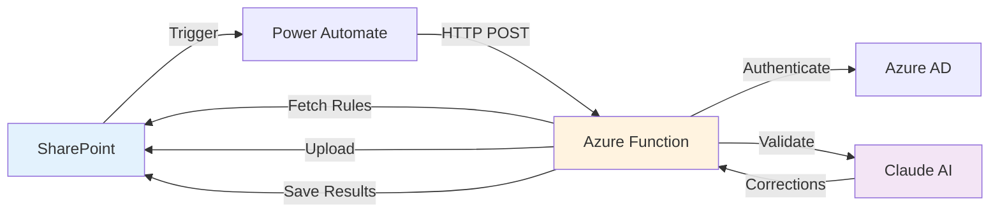

# Mace Style Validator

[](LICENSE)
[](https://www.python.org/downloads/)
[](https://azure.microsoft.com/services/functions/)
[](https://www.anthropic.com/claude)

Automated document validation system that enforces the **Mace Control Centre Writing Style Guide** using Azure Functions, Claude AI, and SharePoint integration.


## 🚀 Features

- **✅ Automatic Validation** - Documents validated on upload to SharePoint
- **🤖 AI-Powered** - Claude 3 Haiku for intelligent language corrections
- **🇬🇧 British English** - Comprehensive British spelling enforcement (25+ rules)
- **📝 Grammar Rules** - Contraction expansion, punctuation, symbol replacement
- **🔧 Auto-Fix** - Most issues corrected automatically
- **📊 Beautiful Reports** - Professional HTML reports with color-coded results
- **📜 Audit Trail** - Complete validation history in SharePoint
- **⚡ Fast** - Typical validation in 5-15 seconds
- **🔒 Secure** - Azure AD authentication, encrypted secrets
- **📈 Scalable** - Serverless architecture, auto-scaling

## 📋 What Gets Validated?

### British English Spelling
```diff
- finalized, color, center, analyze
+ finalised, colour, centre, analyse
```
And 20+ more British spellings!

### Grammar & Contractions
```diff
- can't, don't, won't, isn't
+ cannot, do not, will not, is not
```

### Symbols & Punctuation
```diff
- M&S partnership - 50% growth
+ M and S partnership - 50 percent growth
```

### Number Formatting
```diff
- Budget: 1000 for 5000 items
+ Budget: 1,000 for 5,000 items
```

### Font Consistency
```diff
- Mixed fonts (Calibri, Times New Roman, etc.)
+ All text standardized to Arial
```

## 🏗️ Architecture



**Components:**
- **SharePoint Online** - Document storage & triggers
- **Power Automate** - Workflow orchestration
- **Azure Functions** - Serverless validation logic (Python 3.11)
- **Claude AI** - Advanced language processing
- **Microsoft Graph API** - SharePoint integration
- **Azure AD** - Secure authentication

[📖 Detailed Architecture Documentation](docs/1-technical-architecture.md)

## 🚦 Quick Start

### Prerequisites

- Azure subscription (Owner/Contributor access)
- Microsoft 365 with SharePoint Online
- Power Platform admin access
- Anthropic API key ([Get one here](https://console.anthropic.com))
- Python 3.11+
- Azure Functions Core Tools v4

### Installation

1. **Clone the repository**
   ```bash
   git clone https://github.com/stephencummins/MaceStyle.git
   cd MaceStyle
   ```

2. **Set up Azure resources**
   - Create Azure Function App
   - Create App Registration in Azure AD
   - Configure API permissions (`Sites.ReadWrite.All`, `Files.ReadWrite.All`)

3. **Configure SharePoint**
   - Create site: `/sites/StyleValidation`
   - Create lists: `Style Rules`, `Validation Results`
   - Add custom columns to Document Library

4. **Deploy Azure Function**
   ```bash
   cd MaceStyleValidator

   # Install dependencies
   pip install -r requirements.txt

   # Deploy to Azure
   func azure functionapp publish <your-function-app-name>
   ```

5. **Configure environment variables**
   ```bash
   SHAREPOINT_TENANT_ID="your-tenant-id"
   SHAREPOINT_CLIENT_ID="your-client-id"
   SHAREPOINT_CLIENT_SECRET="your-secret"
   SHAREPOINT_SITE_URL="https://tenant.sharepoint.com/sites/StyleValidation"
   ANTHROPIC_API_KEY="sk-ant-..."
   ```

6. **Populate style rules**
   ```bash
   python3 populate_style_rules.py
   ```

7. **Create Power Automate flow**
   - Trigger: When file created/modified in SharePoint
   - Action: HTTP POST to Azure Function
   - Action: Parse JSON response

[📖 Complete Setup Guide](docs/3-configuration-setup.md)

## 💡 Usage

### For End Users

1. **Upload document** to SharePoint library
2. **Wait for validation** (~10 seconds)
3. **Check results**:
   - Status badge: 🟢 Passed / 🔴 Failed
   - Click **Validation Report** link for details
4. **Download corrected file** (if fixes applied)

[📖 User Guide](docs/2-user-guide.md)

### For Administrators

**Manage validation rules:**
1. Go to **Style Rules** list in SharePoint
2. Add/edit rules:
   - Set `UseAI: Yes` for Claude AI validation
   - Set `AutoFix: Yes` for automatic corrections
   - Adjust `Priority` for execution order

**Monitor validations:**
- Azure Portal → Function App → Application Insights
- SharePoint → Validation Results list
- Review HTML reports for trends

## 📊 Example Validation Report

```html
📋 Style Validation Report
[PASSED Badge]

Document: Project_Report.docx
Validated: 08 November 2025 at 20:42:15 UTC

Summary
┌─────────────┬─────────────┬────────────────┐
│Issues Found │  Auto-Fixed │Remaining Issues│
│     156     │     156     │       0        │
└─────────────┴─────────────┴────────────────┘

✅ Fixes Applied (156)
  ✓ Fixed 145 text runs to Arial
  ✓ Applied 8 style corrections (British English, contractions)
  ✓ Replaced 'finalized' with 'finalised' (3 instances)

⚠️ Issues Detected (156)
  ⚠ Found 145 text runs with incorrect font
  ⚠ Found 8 style violations
```

## 🧪 Testing

A comprehensive test document is included:

```bash
# Create test document with 40+ violations
python3 create_test_document.py

# Upload to SharePoint
# test_files/test_validation_comprehensive.docx
```

**Test document includes:**
- ✅ British English spelling errors
- ✅ Contractions
- ✅ Symbol violations (& and %)
- ✅ Number formatting issues
- ✅ Font inconsistencies

## 📚 Documentation

| Document | Description |
|----------|-------------|
| [Technical Architecture](docs/1-technical-architecture.md) | System design, components, data flow |
| [User Guide](docs/2-user-guide.md) | How to use the validator |
| [Configuration & Setup](docs/3-configuration-setup.md) | Complete installation guide |

## 🔒 Security

- **Azure AD authentication** - Secure service principal
- **Encrypted secrets** - Azure Key Vault / App Settings
- **Minimal permissions** - Principle of least privilege
- **Audit trail** - All validations logged
- **No data persistence** - Documents processed in-memory

## 💰 Costs

**Estimated monthly costs** (for 1,000 documents):

| Service | Cost |
|---------|------|
| Azure Functions (Consumption) | $5-10 |
| Application Insights | $2-5 |
| Claude AI (Haiku) | ~$10 |
| SharePoint | Included in M365 |
| **Total** | **~$17-25/month** |

For 100 documents/month: **~$2-5/month**

## 🛠️ Tech Stack

- **Backend:** Python 3.11, Azure Functions
- **AI:** Claude 3 Haiku (Anthropic)
- **Integration:** Microsoft Graph API, MSAL
- **Document Processing:** python-docx, vsdx
- **Workflow:** Power Automate
- **Storage:** SharePoint Online
- **Auth:** Azure AD (Entra ID)

## 📈 Performance

- **Average processing time:** 5-15 seconds
- **Concurrent validations:** Auto-scaling (Azure Functions)
- **Supported file size:** Up to 100 pages recommended
- **API rate limits:** Graph API throttling handled

## 🤝 Contributing

Contributions are welcome! Please:

1. Fork the repository
2. Create a feature branch (`git checkout -b feature/amazing-feature`)
3. Commit your changes (`git commit -m 'Add amazing feature'`)
4. Push to the branch (`git push origin feature/amazing-feature`)
5. Open a Pull Request

## 🐛 Known Issues

- ✅ Visio validation currently minimal (planned enhancement)
- ✅ Very large files (>100 pages) may timeout
- ✅ Complex table validation limited

See [Issues](https://github.com/stephencummins/MaceStyle/issues) for full list.

## 🗺️ Roadmap

- [ ] Enhanced Visio diagram validation
- [ ] PDF document support
- [ ] Excel spreadsheet validation
- [ ] Multi-language support
- [ ] Custom rule templates
- [ ] Batch validation API
- [ ] Real-time validation in Word Online

## 📝 License

This project is licensed under the MIT License - see the [LICENSE](LICENSE) file for details.

## 👏 Acknowledgments

- **Anthropic** - Claude AI API
- **Microsoft** - Azure Functions, SharePoint, Graph API
- **python-docx** - Word document manipulation
- **Mace Group** - Writing Style Guide

## 📞 Support

- **Documentation:** [docs/](docs/)
- **Issues:** [GitHub Issues](https://github.com/stephencummins/MaceStyle/issues)
- **Discussions:** [GitHub Discussions](https://github.com/stephencummins/MaceStyle/discussions)

## ⭐ Show Your Support

Give a ⭐️ if this project helped you!

---

**Built with ❤️ using Azure Functions & Claude AI**

*Automated document validation has never been easier!*
