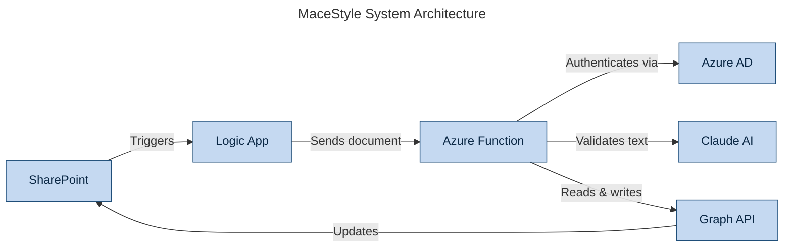

# Mace Style Validator

[](LICENSE)
[](https://www.python.org/downloads/)
[](https://azure.microsoft.com/services/functions/)
[](https://www.anthropic.com/claude)
[](#-governance--compliance)
[](#-governance--compliance)
[](#-governance--compliance)
[](https://github.com/microsoft/agent-governance-toolkit)

Automated document validation system that enforces the **Mace Control Centre Writing Style Guide** using Azure Functions, Claude AI, and SharePoint integration.

**Governance-verified.** Tested and compliant against SOC 2, ISO 27001, and GDPR using the [Microsoft Agent Governance Toolkit v2.1.0](https://github.com/microsoft/agent-governance-toolkit). Access controls, structured audit logging, prompt injection detection, and policy enforcement built in.

## Features

- **Automatic Validation** - Documents validated on upload to SharePoint
- **AI-Powered** - Claude Haiku 4.5 for intelligent language corrections
- **British English** - Comprehensive British spelling enforcement (25+ rules)
- **Grammar Rules** - Contraction expansion, punctuation, symbol replacement
- **Auto-Fix** - Most issues corrected automatically
- **Multi-Format** - Word, Visio, Excel, and PowerPoint support
- **Beautiful Reports** - Professional HTML reports with colour-coded results
- **Audit Trail** - Structured JSON audit events to Application Insights + SharePoint validation history
- **Fast** - Typical validation in 5-15 seconds
- **Secure** - API key + Azure AD access control, encrypted secrets, prompt injection detection
- **Scalable** - Serverless architecture, auto-scaling
- **Governed** - Tested and compliant (SOC 2, ISO 27001, GDPR) via Microsoft Agent Governance Toolkit v2.1.0

## What Gets Validated?

### British English Spelling
```diff
- finalized, color, center, analyze
+ finalised, colour, centre, analyse
```
And 20+ more British spellings!

### Grammar & Contractions
```diff
- can't, don't, won't, isn't
+ cannot, do not, will not, is not
```

### Symbols & Punctuation
```diff
- M&S partnership - 50% growth
+ M and S partnership - 50 percent growth
```

### Number Formatting
```diff
- Budget: 1000 for 5000 items
+ Budget: 1,000 for 5,000 items
```

### Font Consistency
```diff
- Mixed fonts (Calibri, Times New Roman, etc.)
+ All text standardized to Arial
```

## Architecture


```mermaid
---
title: MaceStyle System Architecture
---
graph LR
    SP[SharePoint]:::primary -->|Triggers| LA[Logic App]:::primary
    LA -->|Sends document| AF[Azure Function]:::primary
    AF -->|Authenticates via| AD[Azure AD]:::primary
    AF -->|Validates text| AI[Claude AI]:::primary
    AF -->|Reads & writes| GR[Graph API]:::primary
    GR -->|Updates| SP

    classDef primary fill:#c5d9f1,stroke:#1F4E79,color:#0a2744
    classDef decision fill:#fac775,stroke:#854f0b,color:#412402
    classDef outcome fill:#9fe1cb,stroke:#0f6e56,color:#04342c
```

**Components:**
- **SharePoint Online** - Document storage & triggers
- **Power Automate** - Workflow orchestration
- **Azure Functions** - Serverless validation logic (Python 3.11)
- **Claude AI** - Advanced language processing
- **Microsoft Graph API** - SharePoint integration
- **Azure AD** - Secure authentication

[Detailed Architecture Documentation](docs/1-technical-architecture.md)

## Quick Start

### Prerequisites

- Azure subscription (Owner/Contributor access)
- Microsoft 365 with SharePoint Online
- Power Platform admin access
- Anthropic API key ([Get one here](https://console.anthropic.com))
- Python 3.11+
- Azure Functions Core Tools v4

### Installation

1. **Clone the repository**
   ```bash
   git clone https://github.com/stephencummins/MaceStyle.git
   cd MaceStyle
   ```

2. **Set up Azure resources**
   - Create Azure Function App
   - Create App Registration in Azure AD
   - Configure API permissions (`Sites.Selected` -- see [Security](#-security) below)

3. **Configure SharePoint**
   - Create site: `/sites/StyleValidation`
   - Create lists: `Style Rules`, `Validation Results`
   - Add custom columns to Document Library

4. **Deploy Azure Function**
   ```bash
   cd MaceStyleValidator

   # Install dependencies
   pip install -r requirements.txt

   # Deploy to Azure
   func azure functionapp publish <your-function-app-name>
   ```

5. **Configure environment variables**
   ```bash
   SHAREPOINT_TENANT_ID="your-tenant-id"
   SHAREPOINT_CLIENT_ID="your-client-id"
   SHAREPOINT_CLIENT_SECRET="your-secret"
   SHAREPOINT_SITE_URL="https://tenant.sharepoint.com/sites/StyleValidation"
   ANTHROPIC_API_KEY="sk-ant-..."
   ```

6. **Populate style rules**
   ```bash
   python3 populate_style_rules.py
   ```

7. **Create Power Automate flow**
   - Trigger: When file created/modified in SharePoint
   - Action: HTTP POST to Azure Function
   - Action: Parse JSON response

[Complete Setup Guide](docs/3-configuration-setup.md)

## Usage

### For End Users

1. **Upload document** to SharePoint library
2. **Wait for validation** (~10 seconds)
3. **Check results**:
   - Status badge: Passed / Failed
   - Click **Validation Report** link for details
4. **Download corrected file** (if fixes applied)

[User Guide](docs/2-user-guide.md)

### For Administrators

**Manage validation rules:**
1. Go to **Style Rules** list in SharePoint
2. Add/edit rules:
   - Set `UseAI: Yes` for Claude AI validation
   - Set `AutoFix: Yes` for automatic corrections
   - Adjust `Priority` for execution order

**Monitor validations:**
- Azure Portal > Function App > Application Insights
- SharePoint > Validation Results list
- Review HTML reports for trends

## Example Validation Report

```html
Style Validation Report
[PASSED Badge]

Document: Project_Report.docx
Validated: 08 November 2025 at 20:42:15 UTC

Summary
Issues Found: 156 | Auto-Fixed: 156 | Remaining Issues: 0

Fixes Applied (156)
  Fixed 145 text runs to Arial
  Applied 8 style corrections (British English, contractions)
  Replaced 'finalized' with 'finalised' (3 instances)

Issues Detected (156)
  Found 145 text runs with incorrect font
  Found 8 style violations
```

## Testing

A comprehensive test document is included:

```bash
# Create test document with 40+ violations
python3 create_test_document.py

# Upload to SharePoint
# test_files/test_validation_comprehensive.docx
```

**Test document includes:**
- British English spelling errors
- Contractions
- Symbol violations (& and %)
- Number formatting issues
- Font inconsistencies

## Documentation

| Document | Description |
|----------|-------------|
| [Technical Architecture](docs/1-technical-architecture.md) | System design, components, data flow |
| [User Guide](docs/2-user-guide.md) | How to use the validator |
| [Configuration & Setup](docs/3-configuration-setup.md) | Complete installation guide |
| [Visio Validation Guide](docs/visio-validation-guide.md) | Comprehensive Visio validation documentation |
| [Visio Structural Rules Examples](docs/visio-structural-rules-examples.md) | Ready-to-use SharePoint rules for layout validation |

## Governance & Compliance

MaceStyle has been verified against the [Microsoft Agent Governance Toolkit v2.1.0](https://github.com/microsoft/agent-governance-toolkit) across six assessment categories. All frameworks pass.

| Framework | Status | Controls |
|-----------|--------|----------|
| **SOC 2** | **Compliant** | CC6.1 Access Controls, CC7.2 System Monitoring |
| **ISO 27001** | **Compliant** | Information security management |
| **GDPR** | **Compliant** | No PII processed, data minimisation confirmed |

### What was tested

| Check | Result |
|-------|--------|
| Credential exposure scan | **Clean** - no hardcoded secrets, all from env vars |
| Security controls (10 checks) | **10/10 passed** - file type validation, error handling, MSAL auth, Claude response parsing, path traversal prevention, max_tokens limit, temperature control |
| Prompt injection resilience | **6/6 payloads detected** - including 2 at HIGH threat level |
| Policy engine (adversarial actions) | **3/3 blocked** - system file read, DROP TABLE, credential exposure |
| Governance alignment | **Aligned** - no violations, severity 0.0 |
| Privacy analysis | **No PII** - risk score 0.0 |

### Running the compliance check

The governance check is rerunnable and produces a full markdown report:

```bash
cd MaceStyleValidator
source ../.venv/bin/activate   # Requires agent-governance-toolkit v2.1.0
python3 ../governance_check.py
# Output: governance_report.md
```

### Access Control (SOC 2 CC6.1)

Every request is validated before processing via `access_control.py`:

- **API key mode** (default) - validates `X-Api-Key` or `Authorization: Bearer` header
- **Azure AD mode** - validates `X-MS-CLIENT-PRINCIPAL` with app ID allowlisting
- **Caller identity extraction** - IP, user agent, Azure AD claims, Power Automate run IDs logged to audit trail

### Structured Monitoring (SOC 2 CC7.2)

Every validation emits a structured JSON audit event to Application Insights via `monitoring.py`:

- Request correlation ID, caller identity, document details
- Per-phase timing (auth, rule fetch, download, validation, upload)
- Claude API token usage and estimated cost
- Issues found, fixes applied, report upload status
- Health check endpoint: `GET /api/HealthCheck` (returns `200` healthy / `503` unhealthy)
- Alert emission with severity levels (INFO, WARNING, CRITICAL)

### Grant Per-Site Permissions

Instead of granting tenant-wide access to all SharePoint sites, MaceStyle uses `Sites.Selected` -- a permission that grants **no access by default**. Access is then explicitly granted to only the target site via the Graph API.

1. In Entra ID, grant the app `Sites.Selected` (Application permission) and admin-consent it
2. Run the included helper script to grant access to the specific site:

```bash
python3 grant_site_permissions.py
```

This calls the Graph API to grant read/write access on the target site only. See [docs/azure-admin-setup.md](docs/azure-admin-setup.md) for full details.

## Security

- **Site-scoped permissions** - Uses `Sites.Selected` (not tenant-wide `Sites.ReadWrite.All`)
- **Access control** - API key or Azure AD authentication on every request
- **Azure AD (MSAL)** - Secure service principal for Graph API
- **Encrypted secrets** - Azure Key Vault / App Settings
- **Minimal permissions** - Principle of least privilege
- **Prompt injection detection** - Adversarial payloads caught before reaching Claude
- **Structured audit trail** - JSON events to Application Insights + SharePoint
- **No data persistence** - Documents processed in-memory

## Costs

**Estimated monthly costs** (for 1,000 documents):

| Service | Cost |
|---------|------|
| Azure Functions (Consumption) | $5-10 |
| Application Insights | $2-5 |
| Claude AI (Haiku) | ~$10 |
| SharePoint | Included in M365 |
| **Total** | **~$17-25/month** |

For 100 documents/month: **~$2-5/month**

## Tech Stack

- **Backend:** Python 3.11, Azure Functions v4
- **AI:** Claude Haiku 4.5 (Anthropic)
- **Integration:** Microsoft Graph API, MSAL
- **Document Processing:** python-docx, python-pptx, openpyxl, vsdx
- **Workflow:** Power Automate
- **Storage:** SharePoint Online
- **Auth:** Azure AD (Entra ID) + API key access control
- **Governance:** Microsoft Agent Governance Toolkit v2.1.0
- **Monitoring:** Application Insights + structured JSON audit events

## Performance

- **Average processing time:** 5-15 seconds
- **Concurrent validations:** Auto-scaling (Azure Functions)
- **Supported file size:** Up to 100 pages recommended
- **API rate limits:** Graph API throttling handled

## Contributing

Contributions are welcome! Please:

1. Fork the repository
2. Create a feature branch (`git checkout -b feature/amazing-feature`)
3. Commit your changes (`git commit -m 'Add amazing feature'`)
4. Push to the branch (`git push origin feature/amazing-feature`)
5. Open a Pull Request

## Known Issues

- Very large files (>100 pages) may timeout
- Complex table validation limited
- Visio font detection uses numeric IDs (font 0 = Arial)

See [Issues](https://github.com/stephencummins/MaceStyle/issues) for full list.

## Roadmap

- [x] Enhanced Visio diagram validation (font, colour, text style, structure)
- [x] Visio structural validation (shape size, position, page dimensions)
- [x] Excel spreadsheet validation with write-back
- [x] PowerPoint validation with text run corrections
- [x] SOC 2 / ISO 27001 / GDPR compliance (AGT v2.1.0)
- [x] Structured audit logging and health check endpoint
- [x] Access control (API key + Azure AD)
- [x] Prompt injection detection
- [ ] PDF document support
- [ ] Multi-language support
- [ ] Custom rule templates
- [ ] Batch validation API
- [ ] Real-time validation in Word Online

## License

This project is licensed under the MIT License - see the [LICENSE](LICENSE) file for details.

## Acknowledgments

- **Anthropic** - Claude AI API
- **Microsoft** - Azure Functions, SharePoint, Graph API
- **python-docx** - Word document manipulation
- **Mace Group** - Writing Style Guide

## Support

- **Documentation:** [docs/](docs/)
- **Issues:** [GitHub Issues](https://github.com/stephencummins/MaceStyle/issues)
- **Discussions:** [GitHub Discussions](https://github.com/stephencummins/MaceStyle/discussions)

## Show Your Support

Give a star if this project helped you!

---

**Built with Azure Functions & Claude AI**

*Automated document validation has never been easier!*
