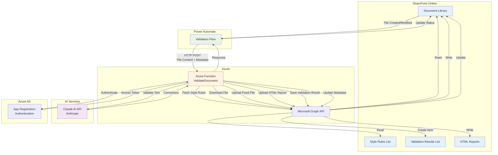
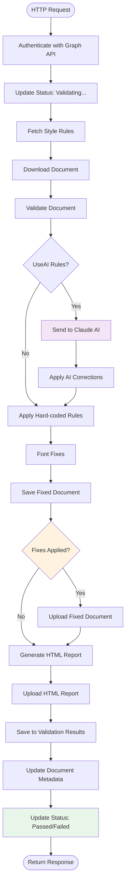
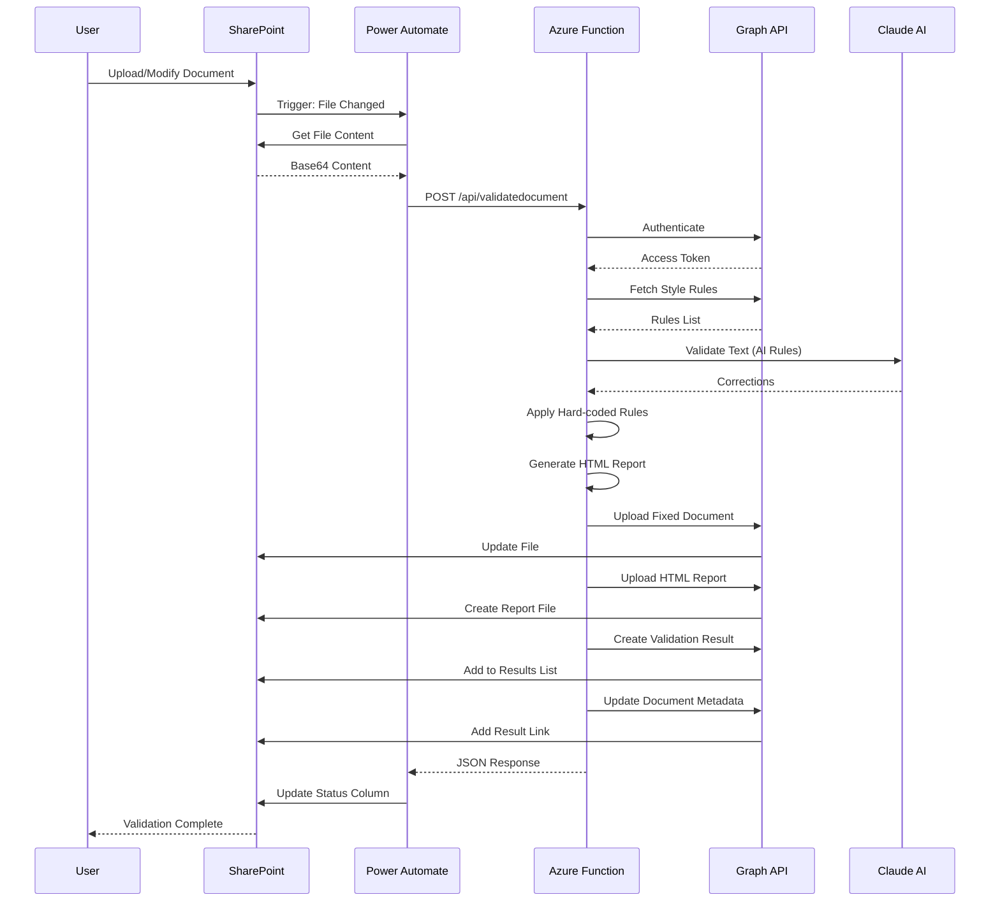
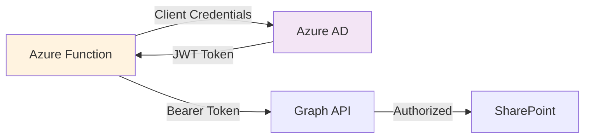

# Mace Style Validator - Technical Architecture

## System Overview

The Mace Style Validator is an automated document validation system that enforces the Mace Control Centre Writing Style Guide using Azure Functions, Claude AI, and SharePoint.

## Architecture Diagram



## Component Details

### 1. SharePoint Document Library
**Purpose:** Store documents and trigger validation

**Columns:**
- `ValidationStatus` (Choice): Validating..., Passed, Failed
- `ValidationResultLink` (Hyperlink): Link to Validation Results list item

**Triggers:** Power Automate flow on file create/modify

---

### 2. SharePoint Style Rules List
**Purpose:** Centralized style rule configuration

**Columns:**
- `Title` (Text): Rule description
- `RuleType` (Choice): Font, Language, Grammar, Punctuation, etc.
- `DocumentType` (Choice): Word, Visio, Both
- `CheckValue` (Text): What to check
- `ExpectedValue` (Text): Correct value
- `AutoFix` (Yes/No): Can be auto-corrected
- `UseAI` (Yes/No): Use Claude AI for validation
- `Priority` (Number): Execution order

**Examples:**
- "Use British English spelling - 'finalised' not 'finalized'"
- "All text must use Arial font"
- "No contractions - use 'cannot' not 'can't'"

---

### 3. SharePoint Validation Results List
**Purpose:** Track validation history and results

**Columns:**
- `Title` (Text): "Validation: {filename}"
- `FileName` (Text): Document name
- `ValidationDate` (DateTime): When validated
- `Status` (Choice): Passed, Failed
- `IssuesFound` (Text): Count of issues
- `IssuesFixed` (Text): Count of fixes
- `ReportLink` (Hyperlink): Link to HTML report

**Features:**
- Permanent history of all validations
- Links to detailed HTML reports
- Searchable and filterable

---

### 4. Power Automate Flow
**Purpose:** Orchestrate validation workflow

**Trigger:** When a file is created or modified (SharePoint)

**Actions:**
1. Get file properties
2. Get file content (base64 encode)
3. HTTP POST to Azure Function
4. Parse JSON response
5. (Optional) Update document metadata

**Data Flow:**
```json
Request to Azure Function:
{
  "itemId": 123,
  "fileName": "document.docx",
  "fileContent": "base64...",
  "fileUrl": "/sites/Site/Shared Documents/document.docx"
}

Response from Azure Function:
{
  "status": "Passed",
  "issuesFound": 10,
  "issuesFixed": 10,
  "reportUrl": "https://...",
  "validationResultUrl": "https://...",
  "reportLink": {
    "Description": "View HTML Report",
    "Url": "https://..."
  },
  "validationResultLink": {
    "Description": "View Validation Result",
    "Url": "https://..."
  },
  "fixedFileContent": "base64..."
}
```

---

### 5. Azure Function (ValidateDocument)
**Purpose:** Core validation logic

**Runtime:** Python 3.11

**Key Dependencies:**
- `python-docx`: Word document manipulation
- `anthropic`: Claude AI SDK
- `msal`: Microsoft authentication
- `requests`: HTTP client

**Validation Flow:**


**Key Functions:**
- `fetch_validation_rules()`: Get rules from SharePoint
- `validate_word_document()`: Apply all validation rules
- `validate_with_claude()`: AI-powered validation
- `generate_report()`: Create styled HTML report
- `save_validation_result()`: Log to Validation Results list

---

### 6. Claude AI Integration
**Purpose:** Advanced language validation

**Model:** Claude 3 Haiku (fast, cost-effective)

**Capabilities:**
- British English spelling corrections
- Contraction expansion
- Symbol replacement (& → and, % → percent)
- Grammar improvements
- Number formatting

**Process:**
1. Extract all text from document
2. Build dynamic prompt from SharePoint rules (UseAI=True)
3. Send to Claude API
4. Parse JSON response with corrections
5. Apply corrections paragraph by paragraph

**Prompt Structure:**
```
You are a professional document editor applying the Mace Control Centre Writing Style Guide.

Apply ALL of the following corrections:
- Use British English spelling - 'finalised' not 'finalized'
- Use British English spelling - 'colour' not 'color'
- No contractions - use 'cannot' not 'can't'
- Avoid ampersand (&) - use 'and' instead

Return JSON: {"corrected_text": "...", "changes_made": 5}
```

---

### 7. Microsoft Graph API
**Purpose:** SharePoint data access

**Permissions Required:**
- `Sites.ReadWrite.All`: Read/write SharePoint content
- `Files.ReadWrite.All`: Read/write documents

**Key Operations:**
- Read/write files in document libraries
- Read/write list items
- Update file metadata
- Query list data

**Authentication:**
- MSAL (Microsoft Authentication Library)
- Client credentials flow (App registration)

---

### 8. Azure App Registration
**Purpose:** Secure authentication

**Configuration:**
- **Tenant ID**: Azure AD tenant
- **Client ID**: Application ID
- **Client Secret**: Authentication credential

**Permissions:**
- Microsoft Graph API delegated permissions
- SharePoint scopes

**Security:**
- Credentials stored in Azure Function App Settings
- Never exposed in code or logs

---

## Data Flow Sequence



---

## Scalability & Performance

### Performance Characteristics
- **Average processing time**: 5-15 seconds per document
- **Bottlenecks**: Claude AI API calls (2-5 seconds)
- **Concurrency**: Azure Functions auto-scale

### Optimization Strategies
1. **Single AI call**: All AI rules processed in one request
2. **Parallel operations**: Font fixes during AI processing
3. **Efficient Graph API**: Batch operations where possible
4. **Caching**: Graph API tokens cached for 60 minutes

### Cost Considerations
- **Azure Functions**: Consumption plan (pay-per-execution)
- **Claude AI**: ~$0.01 per document (Haiku model)
- **Storage**: SharePoint included in Microsoft 365

---

## Security Architecture

### Authentication Flow


### Security Measures
1. **App Registration**: Service principal with minimal permissions
2. **Secret Management**: Azure Key Vault / App Settings (encrypted)
3. **Network Security**: HTTPS only, Azure Function CORS policies
4. **Data Privacy**: Documents processed in-memory, not persisted
5. **Audit Trail**: Validation Results list tracks all operations

---

## Monitoring & Logging

### Azure Function Logging
- **Application Insights**: Performance metrics, errors
- **Log Stream**: Real-time debugging
- **Metrics**: Request count, duration, failures

### Key Metrics to Monitor
- Validation success rate
- Average processing time
- Claude API errors
- SharePoint API throttling
- Document upload failures

### Alerting
- Failed validations > 10%
- Average processing time > 30 seconds
- API errors > 5%

---

## Technology Stack Summary

| Layer | Technology | Purpose |
|-------|-----------|---------|
| **Frontend** | SharePoint Online | Document storage, UI |
| **Workflow** | Power Automate | Orchestration |
| **Backend** | Azure Functions (Python 3.11) | Validation logic |
| **AI** | Claude 3 Haiku (Anthropic) | Language processing |
| **API** | Microsoft Graph API | SharePoint integration |
| **Auth** | Azure AD / MSAL | Authentication |
| **Storage** | SharePoint Lists & Libraries | Data persistence |

---

## Version Information

- **Current Version**: v4.2
- **Last Updated**: November 2025
- **Python Version**: 3.11
- **Azure Functions Runtime**: 4.x
