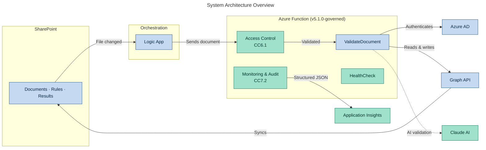
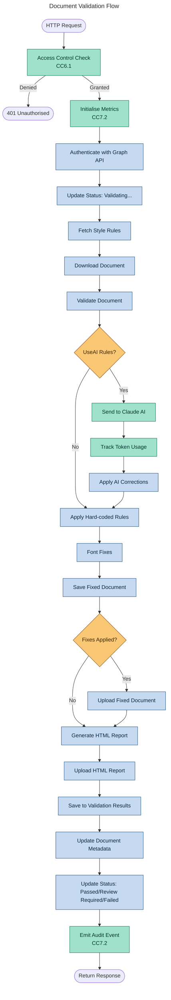
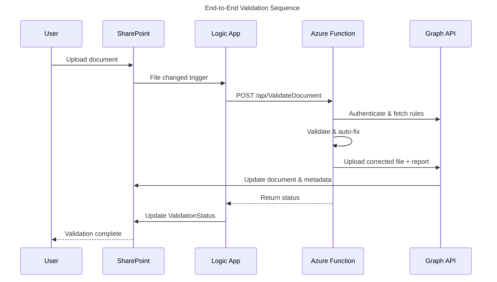
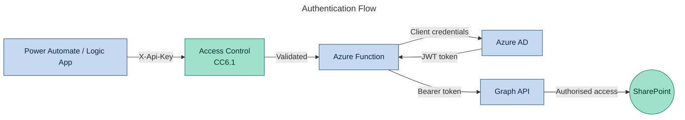

# Mace Style Validator - Technical Architecture

## System Overview

The Mace Style Validator is an automated document validation system that enforces the Mace Control Centre Writing Style Guide using Azure Functions and SharePoint.

> **Note:** Claude AI integration is currently disabled via the `ENABLE_CLAUDE_AI` flag in `config.py`. All hard-coded validation rules continue to run. To re-enable AI-powered style corrections, set `ENABLE_CLAUDE_AI = True`.

## Architecture Diagram


```mermaid
---
title: System Architecture Overview
---
graph LR
    subgraph SharePoint
        SP[Documents · Rules · Results]:::primary
    end
    subgraph Orchestration
        LA[Logic App]:::primary
    end
    subgraph "Azure Function (v5.1.0-governed)"
        ACCESS[Access Control<br/>CC6.1]:::outcome
        AF[ValidateDocument]:::primary
        MONITOR[Monitoring & Audit<br/>CC7.2]:::outcome
        HEALTH[HealthCheck]:::outcome
    end
    GR[Graph API]:::primary
    INSIGHTS[Application Insights]:::outcome
    AD[Azure AD]:::primary
    AI[Claude AI]:::outcome

    SP -->|File changed| LA
    LA -->|Sends document| ACCESS
    ACCESS -->|Validated| AF
    AF -->|Authenticates| AD
    AF -->|Reads & writes| GR
    GR -->|Syncs| SP
    AF -.->|AI validation| AI
    MONITOR -->|Structured JSON| INSIGHTS

    classDef primary fill:#c5d9f1,stroke:#1F4E79,color:#0a2744
    classDef decision fill:#fac775,stroke:#854f0b,color:#412402
    classDef outcome fill:#9fe1cb,stroke:#0f6e56,color:#04342c
```

## Component Details

### 1. SharePoint Document Library
**Purpose:** Store documents and trigger validation

**Columns:**
- `ValidationStatus` (Choice): Not Validated, Validate Now, Validating..., Passed, Review Required, Failed
- `ValidationResultLink` (Hyperlink): Link to Validation Results list item

**Triggers:** Logic App (or Power Automate) on file create/modify

---

### 2. SharePoint Style Rules List
**Purpose:** Centralized style rule configuration

**Columns:**
- `Title` (Text): Rule description
- `RuleType` (Choice): Font, Language, Grammar, Punctuation, etc.
- `DocumentType` (Choice): Word, Visio, Excel, PowerPoint, Both, All
- `CheckValue` (Text): What to check
- `ExpectedValue` (Text): Correct value
- `AutoFix` (Yes/No): Can be auto-corrected
- `UseAI` (Yes/No): Use Claude AI for validation
- `Priority` (Number): Execution order

**Examples:**
- "Use British English spelling - 'finalised' not 'finalized'"
- "All text must use Arial font"
- "No contractions - use 'cannot' not 'can't'"

---

### 3. SharePoint Validation Results List
**Purpose:** Track validation history and results

**Columns:**
- `Title` (Text): "Validation: {filename}"
- `FileName` (Text): Document name
- `ValidationDate` (DateTime): When validated
- `Status` (Choice): Passed, Review Required, Failed
- `IssuesFound` (Text): Count of issues
- `IssuesFixed` (Text): Count of fixes
- `ReportLink` (Hyperlink): Link to HTML report

**Features:**
- Permanent history of all validations
- Links to detailed HTML reports
- Searchable and filterable

---

### 4. Logic App (or Power Automate)
**Purpose:** Orchestrate validation workflow

**Deployment:** ARM template at `infra/logic-app.json` (preferred for production). Power Automate can also be used for dev/testing.

**Trigger:** When a file is created or modified (SharePoint)

**Actions:**
1. Filter to supported file types (.docx, .xlsx, .pptx, .vsdx, etc.)
2. Set ValidationStatus to "Validating..."
3. Get file properties and content (base64 encode)
4. HTTP POST to Azure Function
5. Parse JSON response
6. If fixes applied, upload corrected file back to SharePoint
7. Update document metadata (status, description, report link, etc.)

**Data Flow:**
```json
Request to Azure Function:
{
  "itemId": 123,
  "fileName": "document.docx",
  "fileContent": "base64...",
  "fileUrl": "/sites/Site/Shared Documents/document.docx"
}

Response from Azure Function:
{
  "requestId": "msv-a1b2c3d4e5f6",
  "status": "Passed",
  "issuesFound": 10,
  "issuesFixed": 10,
  "durationMs": 8420,
  "reportUrl": "https://...",
  "validationResultUrl": "https://...",
  "reportLink": {
    "Description": "View HTML Report",
    "Url": "https://..."
  },
  "validationResultLink": {
    "Description": "View Validation Result",
    "Url": "https://..."
  },
  "fixedFileContent": "base64..."
}
```

---

### 5. Azure Function (ValidateDocument)
**Purpose:** Core validation logic

**Runtime:** Python 3.11

**Key Dependencies:**
- `python-docx`: Word document manipulation
- `python-pptx`: PowerPoint document manipulation
- `openpyxl`: Excel document manipulation
- `vsdx`: Visio document manipulation
- `anthropic`: Claude AI SDK (Word only)
- `msal`: Microsoft authentication
- `requests`: HTTP client

**Validation Flow (v5.1.0-governed):**

```mermaid
---
title: Document Validation Flow
---
flowchart TD
    START([HTTP Request]) --> ACCESS[Access Control Check<br/>CC6.1]:::outcome
    ACCESS -->|Denied| DENY([401 Unauthorised])
    ACCESS -->|Granted| METRICS[Initialise Metrics<br/>CC7.2]:::outcome
    METRICS --> AUTH[Authenticate with Graph API]:::primary
    AUTH --> STATUS1[Update Status: Validating...]:::primary
    STATUS1 --> RULES[Fetch Style Rules]:::primary
    RULES --> DOWNLOAD[Download Document]:::primary
    DOWNLOAD --> VALIDATE[Validate Document]:::primary

    VALIDATE --> AI{UseAI Rules?}:::decision
    AI -->|Yes| CLAUDE[Send to Claude AI]:::outcome
    CLAUDE --> TOKENS[Track Token Usage]:::outcome
    TOKENS --> APPLY_AI[Apply AI Corrections]:::primary

    AI -->|No| HARD[Apply Hard-coded Rules]:::primary
    APPLY_AI --> HARD

    HARD --> FONT[Font Fixes]:::primary
    FONT --> SAVE[Save Fixed Document]:::primary

    SAVE --> UPLOAD{Fixes Applied?}:::decision
    UPLOAD -->|Yes| UP_DOC[Upload Fixed Document]:::primary
    UPLOAD -->|No| REPORT
    UP_DOC --> REPORT[Generate HTML Report]:::primary

    REPORT --> UP_REPORT[Upload HTML Report]:::primary
    UP_REPORT --> RES[Save to Validation Results]:::primary
    RES --> META[Update Document Metadata]:::primary
    META --> STATUS2[Update Status: Passed/Review Required/Failed]:::primary
    STATUS2 --> AUDIT[Emit Audit Event<br/>CC7.2]:::outcome
    AUDIT --> END([Return Response])

    classDef primary fill:#c5d9f1,stroke:#1F4E79,color:#0a2744
    classDef decision fill:#fac775,stroke:#854f0b,color:#412402
    classDef outcome fill:#9fe1cb,stroke:#0f6e56,color:#04342c
```

**Key Modules:**
- `word_validator.py`: Word (.docx) validation with AI + hard-coded rules
- `visio_validator.py`: Visio (.vsdx) validation -- hard-coded rules only
- `excel_validator.py`: Excel (.xlsx) validation -- hard-coded rules only
- `powerpoint_validator.py`: PowerPoint (.pptx) validation -- hard-coded rules only
- `ai_client.py`: Claude AI integration (Word only)
- `sharepoint_client.py`: Graph API operations
- `report.py`: HTML report generation (summary + collapsible before/after diffs)
- `sharepoint_results.py`: Validation Results list operations
- `access_control.py`: SOC 2 CC6.1 access control (API key / Azure AD)
- `monitoring.py`: SOC 2 CC7.2 structured audit logging, metrics, health checks

**Note:** AI validation (Claude) is enabled for Word documents only. Visio, Excel, and PowerPoint use hard-coded rules only -- AI was disabled for these formats because diagram/spreadsheet/slide text produces too many false positives and unreliable text write-back.

---

### 6. Claude AI Integration (Currently Disabled)
**Purpose:** Advanced language validation for Word documents

> **Status:** Disabled. Set `ENABLE_CLAUDE_AI = True` in `config.py` to re-enable.

**Model:** Claude Haiku 4.5 (fast, cost-effective)

**Capabilities:**
- British English spelling corrections
- Contraction expansion
- Symbol replacement (& -> and, % -> percent)
- Grammar improvements
- Number formatting

**Process:**
1. Extract all text from document
2. Build dynamic prompt from SharePoint rules (UseAI=True)
3. Send to Claude API
4. Parse JSON response with corrections
5. Apply corrections paragraph by paragraph

**Prompt Structure:**
```
You are a professional document editor applying the Mace Control Centre Writing Style Guide.

Apply ALL of the following corrections:
- Use British English spelling - 'finalised' not 'finalized'
- Use British English spelling - 'colour' not 'color'
- No contractions - use 'cannot' not 'can't'
- Avoid ampersand (&) - use 'and' instead

Return JSON: {"corrected_text": "...", "changes_made": 5}
```

---

### 7. Microsoft Graph API
**Purpose:** SharePoint data access

**Permissions Required:**
- `Sites.Selected`: Site-scoped access (granted per-site via Graph API, not tenant-wide)

**Key Operations:**
- Read/write files in document libraries
- Read/write list items
- Update file metadata
- Query list data

**Authentication:**
- MSAL (Microsoft Authentication Library)
- Client credentials flow (App registration)

---

### 8. Azure App Registration
**Purpose:** Secure authentication

**Configuration:**
- **Tenant ID**: Azure AD tenant
- **Client ID**: Application ID
- **Client Secret**: Authentication credential

**Permissions:**
- Microsoft Graph API delegated permissions
- SharePoint scopes

**Security:**
- Credentials stored in Azure Function App Settings
- Never exposed in code or logs

---

## Data Flow Sequence


```mermaid
---
title: End-to-End Validation Sequence
---
sequenceDiagram
    participant User
    participant SP as SharePoint
    participant LA as Logic App
    participant AF as Azure Function
    participant Graph as Graph API

    User->>SP: Upload document
    SP->>LA: File changed trigger
    LA->>AF: POST /api/ValidateDocument
    AF->>Graph: Authenticate & fetch rules
    AF->>AF: Validate & auto-fix
    AF->>Graph: Upload corrected file + report
    Graph->>SP: Update document & metadata
    AF-->>LA: Return status
    LA->>SP: Update ValidationStatus
    SP-->>User: Validation complete
```

---

## Scalability & Performance

### Performance Characteristics
- **Average processing time**: 5-15 seconds per document
- **Bottlenecks**: Claude AI API calls (2-5 seconds)
- **Concurrency**: Azure Functions auto-scale

### Optimization Strategies
1. **Single AI call**: All AI rules processed in one request
2. **Parallel operations**: Font fixes during AI processing
3. **Efficient Graph API**: Batch operations where possible
4. **Caching**: Graph API tokens cached for 60 minutes

### Cost Considerations
- **Azure Functions**: Consumption plan (pay-per-execution)
- **Claude AI**: ~$0.01 per document (Haiku model)
- **Storage**: SharePoint included in Microsoft 365

---

## Security Architecture

### Authentication Flow

```mermaid
---
title: Authentication Flow
---
graph LR
    PA[Power Automate / Logic App]:::primary -->|X-Api-Key| AC[Access Control<br/>CC6.1]:::outcome
    AC -->|Validated| AF[Azure Function]:::primary
    AF -->|Client credentials| AAD[Azure AD]:::primary
    AAD -->|JWT token| AF
    AF -->|Bearer token| GR[Graph API]:::primary
    GR -->|Authorised access| SP((SharePoint)):::outcome

    classDef primary fill:#c5d9f1,stroke:#1F4E79,color:#0a2744
    classDef decision fill:#fac775,stroke:#854f0b,color:#412402
    classDef outcome fill:#9fe1cb,stroke:#0f6e56,color:#04342c
```

### Access Control (SOC 2 CC6.1)

Every incoming request is validated by `access_control.py` before processing begins.

**Auth Modes** (configured via `MACESTYLE_AUTH_MODE`):

| Mode | Header | Use Case |
|------|--------|----------|
| `api_key` (default) | `X-Api-Key` or `Authorization: Bearer <key>` | Power Automate, service-to-service |
| `azure_ad` | `X-MS-CLIENT-PRINCIPAL` (Azure EasyAuth) | Azure AD-authenticated callers |
| `none` | -- | Local development only |

**Caller Identity Extraction:**
- Client IP (via `X-Forwarded-For`)
- User agent
- Azure AD claims (name, email, app ID)
- Power Automate workflow run ID (`X-MS-Workflow-Run-Id`)

**Environment Variables:**
- `MACESTYLE_API_KEY` -- Static API key for validation
- `MACESTYLE_AUTH_MODE` -- Auth mode selector
- `MACESTYLE_ALLOWED_APPS` -- Comma-separated Azure AD app IDs allowed to call

### Other Security Measures
1. **App Registration**: Service principal with `Sites.Selected` -- access granted to a single SharePoint site only (not tenant-wide)
2. **Secret Management**: Azure Key Vault / App Settings (encrypted)
3. **Network Security**: HTTPS only, Azure Function CORS policies
4. **Data Privacy**: Documents processed in-memory, not persisted
5. **Audit Trail**: Structured audit events + Validation Results list

---

## Monitoring & Observability (SOC 2 CC7.2)

Structured monitoring is implemented in `monitoring.py`, providing per-request metrics, audit events, and health checks.

### Structured Audit Events

Every validation emits a JSON audit event to Application Insights:

```json
{
  "event_type": "validation_complete",
  "request_id": "msv-a1b2c3d4e5f6",
  "timestamp": "2026-03-22T18:23:05+00:00",
  "duration_ms": 8420,
  "caller": {
    "ip": "10.0.0.1",
    "user_agent": "PowerAutomate/1.0",
    "auth_mode": "api_key",
    "power_automate_run_id": "abc-123"
  },
  "document": {
    "filename": "report.docx",
    "file_type": ".docx",
    "file_size_bytes": 245760
  },
  "validation": {
    "status": "Passed",
    "rules_loaded": 42,
    "ai_rules_count": 12,
    "issues_found": 8,
    "fixes_applied": 8,
    "report_uploaded": true
  },
  "ai_usage": {
    "claude_calls": 1,
    "input_tokens": 3200,
    "output_tokens": 1800,
    "estimated_cost_usd": 0.0098
  },
  "performance": {
    "total_ms": 8420,
    "phases_ms": {
      "auth": 120,
      "fetch_rules": 340,
      "download": 280,
      "validation": 5200,
      "upload_fixed": 1100,
      "upload_report": 980
    },
    "sharepoint_calls": 5
  }
}
```

### Health Check Endpoint

`GET /api/HealthCheck` returns system status:

```json
{
  "status": "healthy",
  "version": "5.1.0-governed",
  "checks": {
    "environment": { "status": "healthy", "missing_vars": [] },
    "claude_api": { "status": "healthy", "detail": "API key configured" },
    "access_control": { "status": "healthy", "auth_mode": "api_key" }
  }
}
```

Returns `200` when healthy, `503` when unhealthy.

### Alerting

Alert events are emitted via `emit_alert()` with severity levels:

| Severity | Trigger | Action |
|----------|---------|--------|
| `INFO` | Normal events | Log only |
| `WARNING` | Validation failures, API errors | Log + Application Insights alert |
| `CRITICAL` | System errors, auth failures | Log + immediate alert |

### Key Metrics

| Metric | Source | Purpose |
|--------|--------|---------|
| Request duration (total + per-phase) | `monitoring.py` | Performance tracking |
| Claude API tokens (input/output) | `ai_client.py` | Cost tracking |
| Estimated cost per request | `monitoring.py` | Budget monitoring |
| SharePoint API call count | `monitoring.py` | Rate limit awareness |
| Issues found vs fixed ratio | `monitoring.py` | Rule effectiveness |
| Request correlation ID | `monitoring.py` | Cross-service tracing |

---

## Governance -- Microsoft Agent Governance Toolkit v2.1.0

MaceStyle has been checked and verified against the Microsoft Agent Governance Toolkit. A rerunnable compliance verification script is included.

### Compliance Status (22 March 2026)

| Framework | Status | Details |
|-----------|--------|---------|
| **SOC 2** | COMPLIANT | CC6.1 (access controls) + CC7.2 (system monitoring) |
| **ISO 27001** | COMPLIANT | -- |
| **GDPR** | COMPLIANT | No PII processed, data minimisation confirmed |

### Checks Performed

1. **Credential exposure scan** -- No hardcoded secrets detected
2. **Security controls** -- 10/10 passed (file type validation, error handling, MSAL auth, Claude response parsing, path traversal prevention)
3. **Prompt injection resilience** -- 6/6 adversarial payloads detected (2 at HIGH threat level)
4. **Policy engine** -- 3 adversarial actions correctly blocked (system file read, DROP TABLE, credential exposure)
5. **Governance assessment** -- Aligned, no privacy concerns

### Running the Check

```bash
cd ~/Projects/MaceStyle
source .venv/bin/activate   # Requires agent-governance-toolkit v2.1.0
python3 governance_check.py
```

Output: `governance_report.md` (full results in markdown)

---

## Technology Stack Summary

| Layer | Technology | Purpose |
|-------|-----------|---------|
| **Frontend** | SharePoint Online | Document storage, UI |
| **Workflow** | Logic App (ARM template) | Orchestration |
| **Backend** | Azure Functions (Python 3.11) | Validation logic |
| **AI** | Claude Haiku 4.5 (Anthropic) | Language processing (currently disabled) |
| **API** | Microsoft Graph API | SharePoint integration |
| **Auth** | Azure AD / MSAL + API key | Authentication |
| **Storage** | SharePoint Lists & Libraries | Data persistence |
| **Governance** | MS Agent Governance Toolkit v2.1.0 | Compliance verification |
| **Monitoring** | Application Insights + structured audit | Observability |

---

## Version Information

- **Current Version**: v5.1.0-governed
- **Last Updated**: March 2026
- **Python Version**: 3.11
- **Azure Functions Runtime**: 4.x
- **Governance Toolkit**: Microsoft Agent Governance Toolkit v2.1.0
