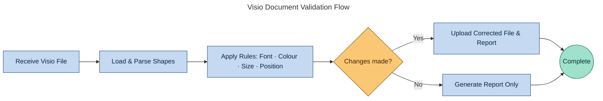

# Visio Validation Guide

## Overview

The Mace Style Validator supports comprehensive validation for Microsoft Visio (.vsdx) files, including structural checks, font standardisation, and colour consistency. Hard-coded rules only — AI validation is disabled for Visio (diagram shape text produces too many false positives and text write-back can corrupt documents).

## Supported Validations

### 1. Structural Validation (NEW!)

#### A. Shape Size Validation

Standardise shape dimensions to ensure consistency across diagrams.

**Rule Configuration:**
```
Title: Visio - Title Box Size
RuleType: Size
DocumentType: Visio
CheckValue: TitleBoxSize
ExpectedValue: 3.0x1.0
AutoFix: Yes
Priority: 90
Tolerance: 0.1
```

**Parameters:**
- `ExpectedValue`: Format `WIDTHxHEIGHT` in inches (e.g., `3.0x1.0`)
- `Tolerance`: Acceptable variance in inches (default: 0.1)

**Example Use Cases:**
- Title boxes: `3.0x1.0` (3" wide × 1" tall)
- Icons: `0.5x0.5` (square icons)
- Process boxes: `2.0x1.5`
- Legend boxes: `4.0x2.0`

**Location:** `__init__.py:678-746`

#### B. Position Validation

Ensure shapes are positioned within specified margins or at exact coordinates.

**Position Types:**

**1. Top Margin (Headers)**
```
Title: Visio - Header Position
RuleType: Position
DocumentType: Visio
CheckValue: TopMargin
ExpectedValue: 2.0
AutoFix: Yes
Tolerance: 0.1
```
Ensures shapes stay within top 2" of page.

**2. Left Margin**
```
Title: Visio - Left Alignment
RuleType: Position
CheckValue: LeftMargin
ExpectedValue: 1.0
AutoFix: Yes
```
Ensures shapes don't extend beyond 1" from left edge.

**3. Right Margin**
```
CheckValue: RightMargin
ExpectedValue: 10.0
```
Ensures shapes stay left of 10" mark.

**4. Bottom Margin**
```
CheckValue: BottomMargin
ExpectedValue: 1.0
```
Ensures shapes stay above 1" from bottom.

**5. Exact Position**
```
Title: Visio - Logo Position
CheckValue: ExactPosition
ExpectedValue: 0.5,7.5
AutoFix: Yes
Tolerance: 0.05
```
Positions shapes at exact X,Y coordinates (format: `X,Y`).

**Location:** `__init__.py:748-846`

#### C. Page Dimensions Validation

Standardise page sizes across all Visio diagrams.

**Rule Configuration:**
```
Title: Visio - Standard Page Size
RuleType: PageDimensions
DocumentType: Visio
CheckValue: PageSize
ExpectedValue: 11.0x8.5
AutoFix: Yes
Priority: 80
```

**Common Page Sizes:**
- Letter Landscape: `11.0x8.5`
- Letter Portrait: `8.5x11.0`
- A4 Landscape: `11.69x8.27`
- A4 Portrait: `8.27x11.69`
- Legal: `14.0x8.5`
- Tabloid: `17.0x11.0`

**Location:** `__init__.py:848-897`

### 2. Text Style Validation (Disabled)

> **Note:** AI-powered text validation has been disabled for Visio. Diagram shape text (short labels, connector text, etc.) produces too many false positives with AI, and writing corrected text back to shapes can corrupt the document. Text style rules (British English, contractions, symbols) are applied only to Word documents.

### 3. Font Validation

Standardizes fonts across all Visio shapes to ensure consistency.

**Rule Configuration in SharePoint:**
```
Title: Visio - All Fonts Must Be Arial
RuleType: Font
DocumentType: Visio (or Both)
CheckValue: AllTextFont
ExpectedValue: Arial
AutoFix: Yes
Priority: 100
```

**Implementation:**
- Checks font settings in Character section cells
- Sets font to 0 (Visio's default/Arial)
- Processes all shapes with text content
- Handles nested/grouped shapes

**Location:** `__init__.py:604-676`

### 4. Color Validation

Ensures consistent branding colors for both shape fills and text.

**Rule Configuration for Fill Color:**
```
Title: Visio - Shape Fill Color
RuleType: Color
DocumentType: Visio (or Both)
CheckValue: ShapeFillColor
ExpectedValue: #003399
AutoFix: Yes
Priority: 101
```

**Rule Configuration for Text Color:**
```
Title: Visio - Text Color
RuleType: Color
DocumentType: Visio (or Both)
CheckValue: ShapeTextColor
ExpectedValue: #000000
AutoFix: Yes
Priority: 102
```

**Implementation:**
- Uses vsdx library's `fill_color` and `text_color` properties
- Supports hex color values (#RRGGBB)
- Recursively processes all shapes
- Only checks shapes with visible text

**Location:** `__init__.py:547-602`

## Technical Details

### Shape Processing

Both font and color validators use recursive shape processing:

```python
def process_shapes_recursively(shapes):
    for shape in shapes:
        # Check shapes with text only
        if hasattr(shape, 'text') and shape.text:
            # Validation logic here
            pass

        # Process nested shapes
        if hasattr(shape, 'child_shapes'):
            process_shapes_recursively(shape.child_shapes)
```

### Font Cell Reference

Visio stores font information in Character section cells:
- **Cell name:** `Char.Font`
- **Value format:** Integer (0 = Arial/default)
- **Access method:** `shape.set_cell_value('Char.Font', '0')`

Reference: [Microsoft Docs - Font Cell (Character Section)](https://learn.microsoft.com/en-us/office/client-developer/visio/font-cell-character-section)

### Color Properties

The vsdx library provides direct color access:
- **Fill color:** `shape.fill_color` (getter/setter)
- **Text color:** `shape.text_color` (getter/setter)
- **Format:** Hex string (#RRGGBB)

Added in vsdx v0.5.12

## Validation Flow



## Quick Start: Structural Validation Examples

### Complete Rule Set for Corporate Standards

Here's a complete set of structural rules you can add to SharePoint:

#### 1. Standardise Title Box Dimensions
```
Title: Visio - Title Box Must Be 3"×1"
RuleType: Size
DocumentType: Visio
CheckValue: TitleBoxSize
ExpectedValue: 3.0x1.0
AutoFix: Yes
Priority: 90
Tolerance: 0.1
Description: All title boxes must be exactly 3 inches wide by 1 inch tall
```

#### 2. Enforce Header Position
```
Title: Visio - Headers Stay at Top
RuleType: Position
DocumentType: Visio
CheckValue: TopMargin
ExpectedValue: 2.0
AutoFix: Yes
Priority: 91
Tolerance: 0.1
Description: All header shapes must be within top 2 inches of page
```

#### 3. Standardise Page Size
```
Title: Visio - Letter Landscape Only
RuleType: PageDimensions
DocumentType: Visio
CheckValue: PageSize
ExpectedValue: 11.0x8.5
AutoFix: Yes
Priority: 80
Description: All diagrams must use Letter size landscape orientation
```

#### 4. Position Company Logo
```
Title: Visio - Logo at Top-Left
RuleType: Position
DocumentType: Visio
CheckValue: ExactPosition
ExpectedValue: 0.5,7.5
AutoFix: Yes
Priority: 85
Tolerance: 0.05
Description: Company logo must be positioned at 0.5", 7.5" coordinates
```

#### 5. Icon Size Standardization
```
Title: Visio - Icons Must Be 0.5" Square
RuleType: Size
DocumentType: Visio
CheckValue: IconSize
ExpectedValue: 0.5x0.5
AutoFix: Yes
Priority: 92
Tolerance: 0.05
Description: All icon shapes must be exactly 0.5" × 0.5"
```

## Creating Visio Validation Rules

### Step 1: Add Rule to SharePoint

Navigate to: `SharePoint > Style Validation > Style Rules List`

### Step 2: Create Structural Rules

**For Shape Size:**
| Column | Value |
|--------|-------|
| Title | Visio - Title Box Size |
| RuleType | Size |
| DocumentType | Visio |
| CheckValue | TitleBoxSize |
| ExpectedValue | 3.0x1.0 |
| AutoFix | Yes |
| Priority | 90 |
| Tolerance | 0.1 |

**For Position:**
| Column | Value |
|--------|-------|
| Title | Visio - Header Position |
| RuleType | Position |
| DocumentType | Visio |
| CheckValue | TopMargin |
| ExpectedValue | 2.0 |
| AutoFix | Yes |
| Priority | 91 |
| Tolerance | 0.1 |

**For Page Dimensions:**
| Column | Value |
|--------|-------|
| Title | Visio - Standard Page Size |
| RuleType | PageDimensions |
| DocumentType | Visio |
| CheckValue | PageSize |
| ExpectedValue | 11.0x8.5 |
| AutoFix | Yes |
| Priority | 80 |

### Step 3: Create Font Rule

| Column | Value |
|--------|-------|
| Title | Visio - Standardise All Fonts |
| RuleType | Font |
| DocumentType | Visio |
| CheckValue | AllTextFont |
| ExpectedValue | Arial |
| AutoFix | Yes |
| UseAI | No |
| Priority | 100 |

### Step 3: Create Color Rules

**Fill Color:**
- CheckValue: `ShapeFillColor`
- ExpectedValue: `#003399` (your brand blue)

**Text Color:**
- CheckValue: `ShapeTextColor`
- ExpectedValue: `#000000` (black)

### Note on AI Validation

AI validation is **disabled for Visio** — only hard-coded rules (Font, Color, Size, Position, PageDimensions) are applied. AI text corrections are enabled for Word documents only.

## Testing Visio Validation

### Manual Test File Creation

1. **Open Microsoft Visio** (Desktop version recommended)
2. **Create test diagram** with shapes containing:
   - American spellings: "finalized", "color"
   - Contractions: "can't", "don't"
   - Symbols: "M&S", "50%"
   - Unformatted numbers: "1000", "5000"
3. **Vary fonts**: Use Calibri, Times New Roman, etc.
4. **Vary colors**: Apply different fill/text colors
5. **Save as .vsdx**
6. **Upload to SharePoint**

### Expected Results

After validation:
- ✅ All fonts set to Arial
- ✅ All colours matching brand standards
- ✅ Shape sizes standardised
- ✅ Page dimensions corrected

### Validation Report

Check the HTML report for:
- Issues detected count
- Fixes applied count
- Detailed list of corrections
- Status: Passed/Failed

## Limitations

### Current Limitations

1. **Font Name Display**: Visio uses numeric font IDs, so the validator sets font to 0 (default/Arial) but may not detect the actual font name
2. **Complex Formatting**: Rich text formatting within single shapes may not be fully preserved
3. **Color Detection**: Only checks if colors exist and differ; doesn't report original color values
4. **Grouped Shapes**: Some deeply nested or grouped shapes may be skipped

### Library Constraints

The vsdx Python library (v0.5.8) has limitations:
- No direct font name API (uses cell values)
- Limited access to advanced formatting properties
- Some shape types may not expose all properties

### Workarounds

For advanced scenarios:
- Use pywin32 COM interface for Windows environments
- Pre-process files with Visio macros
- Manual review for critical diagrams

## Troubleshooting

### Font Validation Not Working

**Symptom:** Font fixes not applied

**Solutions:**
1. Check shape has text: `shape.text` must be non-empty
2. Verify AutoFix enabled in rule
3. Check logs for "Could not set font" warnings
4. Ensure vsdx library version ≥0.5.8

### Color Validation Not Working

**Symptom:** Colors unchanged after validation

**Solutions:**
1. Verify shape has `fill_color` or `text_color` property
2. Check expected color format: Must be hex (#RRGGBB)
3. Ensure shape is not locked/protected
4. Review Application Insights logs

### Text Corrections Not Available

AI text corrections are disabled for Visio. Text style rules (British English, contractions, symbols) apply only to Word documents.

## Performance Considerations

### Processing Time

Typical Visio validation times:
- **Small diagrams** (1-5 shapes): 3-5 seconds
- **Medium diagrams** (10-50 shapes): 5-10 seconds
- **Large diagrams** (100+ shapes): 10-20 seconds

AI validation is disabled for Visio, so processing is fast.

### Optimization Tips

1. **Disable unused rules**: Set AutoFix: No for rules you don't need
2. **Limit AI rules**: Only enable UseAI for necessary validations
3. **Batch processing**: Process multiple files in parallel via Power Automate
4. **Use caching**: Validation Results list tracks recent validations

## Code References

| Feature | File |
|---------|------|
| Main Visio validation | `visio_validator.py` |
| Shape size validation | `visio_validator.py` (`_check_shape_size`) |
| Position validation | `visio_validator.py` (`_check_position`) |
| Page dimensions validation | `visio_validator.py` (`_check_page_dimensions`) |
| Font checking | `visio_validator.py` (`_check_fonts`) |
| Colour checking | `visio_validator.py` (`_check_colors`) |
| Shape text extraction | `visio_validator.py` (`_extract_shape_texts`) |

## Future Enhancements

Planned improvements:
- [ ] Font name detection and reporting
- [ ] Color palette validation (brand compliance)
- [ ] Line style and weight standardization
- [x] Shape size and positioning rules ✅ IMPLEMENTED
- [x] Page dimension standardization ✅ IMPLEMENTED
- [ ] Alignment validation (horizontal/vertical)
- [ ] Spacing between shapes
- [ ] Connector validation
- [ ] Layer-based validation rules
- [ ] Master shape validation
- [ ] Grid snap validation
- [ ] Shape distribution (even spacing)

## Support

For issues with Visio validation:
- Check Azure Function logs via Application Insights
- Review HTML validation reports
- Consult [vsdx library documentation](https://vsdx.readthedocs.io/)
- Report bugs at: [GitHub Issues](https://github.com/stephencummins/MaceStyle/issues)

---

**Last Updated:** March 2026
**Version:** 2.0
**Implemented in:** MaceStyleValidator v5.0+
